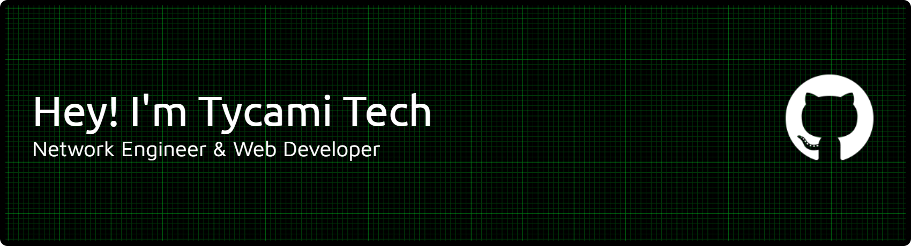

# 👋 Hi there, I'm Ryandiq Fawwas Nafeeza!

### Network Engineer & Web Developer

A talented Network Engineer & Web Developer from the Axioo Industry Class at **SMK PGRI 1 Ngawi**. Experienced in designing stable network infrastructure using MikroTik technology and managing Linux-based servers. Additionally, I have a strong passion for building modern, responsive, and efficient web solutions.

---

### 🚀 Areas of Expertise

- 🌐 **Network Engineering**
- 💻 **Web Development**
- 🔒 **Network Security**
- 🖥️ **Server Management**

---
### Social Media

###

  
  
  
  

### Skills

  
  
  
  
  
  
  
  
  
  
  
  
  
  
  
  
  
  
  
  
  
  
  
  
  
  
  
  
  
  
  
  
  
  
  
  
  
  

 

###

<picture>
  <source media="(prefers-color-scheme: dark)" srcset="https://raw.githubusercontent.com/TycamiTech/TycamiTech/output/pacman-contribution-graph-dark.svg">
  <source media="(prefers-color-scheme: light)" srcset="https://raw.githubusercontent.com/TycamiTech/TycamiTech/output/pacman-contribution-graph.svg">
  
</picture>

###

  

###

  

###